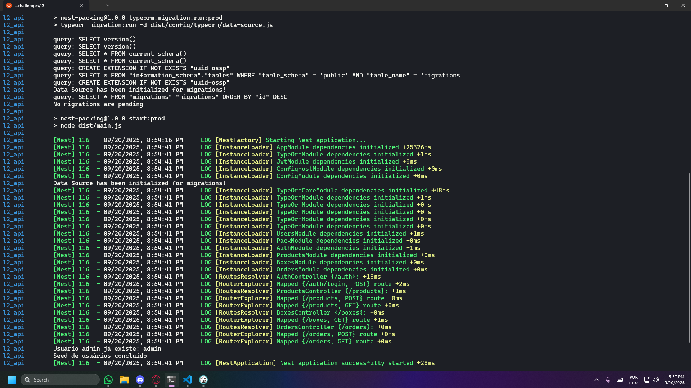
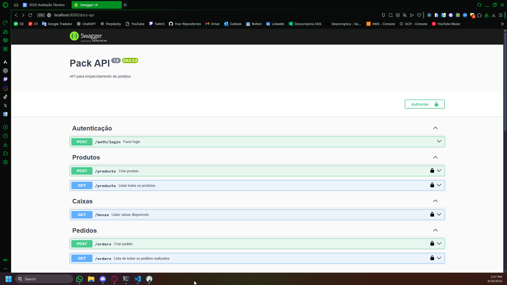
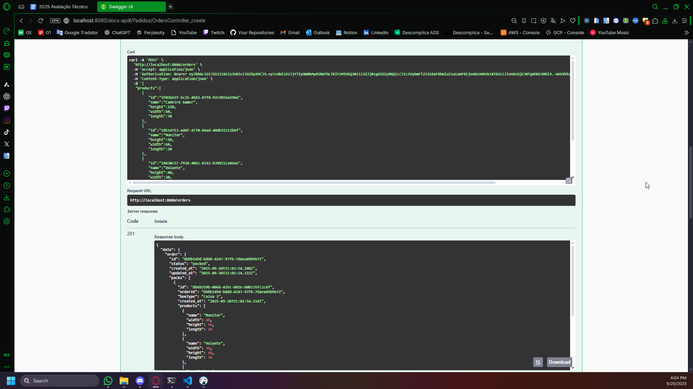

# 📦 Exercício 1 - Loja do Seu Manoel - API de Empacotamento

Este projeto é uma API em Node.js utilizando NestJS que automatiza o empacotamento de pedidos da Loja do Seu Manoel. A aplicação recebe pedidos com produtos e suas dimensões e retorna a melhor forma de embalar os produtos em caixas de papelão disponíveis, otimizando o uso de espaço.

A API já inclui testes unitários e pode ser executada facilmente com Docker.

---

## 🧠 Objetivo

Permitir que pedidos sejam empacotados automaticamente em caixas de papelão, especificando quais produtos vão em cada caixa e minimizando o número de caixas utilizadas.  

- **Backend**: API REST em Node.js com NestJS  
- **Banco de Dados**: PostgreSQL via TypeORM  
- **Testes Unitários**: Jest  
- **Documentação da API**: Swagger  

---

## ⚙️ Tecnologias principais

- Node.js + NestJS  
- TypeScript  
- PostgreSQL + TypeORM  
- Docker + Docker Compose  
- Jest para testes unitários  
- Swagger para documentação da API  

---

## 🚀 Como Iniciar o Projeto (Docker)

### Pré-requisitos
* Docker Desktop instalado e em execução.

### 1️⃣ Clonar o repositório
```bash
git clone <url-do-repositorio>
cd loja-seu-manoel
````

### 2️⃣ Configurar o arquivo de ambiente

Na raiz do projeto, copie o arquivo `.env.example` para `.env` e configure suas variáveis (PostgreSQL, usuário admin, etc):

```bash
cp .env.example .env
```

### 3️⃣ Subir o ambiente completo

Execute o comando abaixo para construir as imagens Docker e iniciar todos os serviços (backend, banco de dados). O banco já será populado com seeds iniciais (caixas, produtos e usuário):

```bash
docker compose up --build
```

### 4️⃣ Acessar a aplicação

* **API (Swagger)**: [http://localhost:8080/api/docs](http://localhost:8080/api/docs)

---

## Evidências do projeto

Api Executando



Documentação no Swagger



Pedido processado e retornando dentro da caixa



## 🔐 Requisitos opcionais implementados

* Autenticação básica de usuários via JWT
* Módulo de Usuários
* PostgreSQL como banco de dados relacional
* TypeORM para gerenciamento das entidades e relacionamentos
* Seeds iniciais para caixas, produtos e usuário admin
* Testes unitários com Jest

> 💡 Observação: **apenas rodar o Docker já inicializa tudo automaticamente**, incluindo banco, seeds e aplicação pronta para uso.

---

## 🚀 Evoluções planejadas / já implementadas

* Implementação de múltiplos tamanhos de caixas e lógica de otimização de empacotamento
* Endpoint para criar, listar e gerenciar pedidos e produtos
* Suporte a autenticação e controle de usuários
* Documentação completa via Swagger para facilitar testes e integração
* Testes unitários cobrindo usecases, reposittories, serviços e lógica de empacotamento

---

# Exercício 2 - HORÁRIOS DE AULA

O projeto do Exercício 2 está disponível na pasta **classtimes/** deste repositório.

## Sobre o sistema

O sistema foi desenvolvido para demonstrar consultas de horários de aula, professores e salas, conforme solicitado pelo Professor Girafales.

### Principais funcionalidades:
- Consulta da quantidade de horas que cada professor tem comprometido em aulas (SQL pronta).
- Listagem de salas com horários livres e ocupados (SQL pronta).

### Estrutura e seed de demonstração
Ao iniciar o sistema, uma estrutura de tabelas e um seed de dados são criados automaticamente, permitindo testar e visualizar os relatórios sem necessidade de cadastro manual.

### Como executar
1. Acesse a pasta `classtimes/`.
2. Execute:
	```bash
	docker compose up --build -d
	docker compose up
	```
3. Os relatórios serão exibidos no console, já utilizando dados de exemplo.

Para detalhes das consultas e exemplos, veja o arquivo `README.md` dentro da pasta `classtimes/`.

## 📄 Licença

Projeto criado por [Tiago Gonçalves](https://www.linkedin.com/in/tiagogoncalvesdecastro) como parte de exercício técnico de automação de empacotamento.